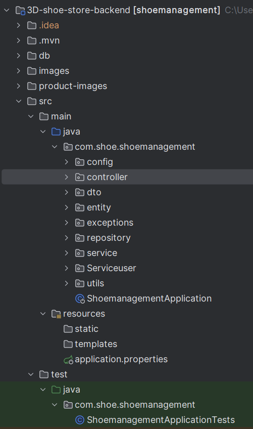

# 3D Shoe Store Backend

This backend is part of a 3D e-commerce platform for selling shoes, handling inventory, employee and sales performance management. Built with **Spring Boot** and **MySQL**, it also integrates **PayHere** as the payment gateway.

---

## Key Features
- **Product Management**: CRUD operations for shoes in the store.
- **Employee Management**: Track employee roles and performance.
- **Sales Tracking**: Analyze and monitor sales metrics.
- **User Authentication & Authorization**: Role-based access control for secure features.
- **Payment Gateway Integration**: Seamless online payments via PayHere.
- **Image Management**: Easy storage and retrieval of product images.
- **Cart Functionality**: (In Progress) Customer shopping cart under development.
- **Data Security**: Secure management of user and transaction data.

---

## What's New
- **Hibernate Configuration**: Automatically creates database and tables on startup.
- **Service & DAO Classes**: Modular and reusable code for business logic and database operations.
- **IDE Compatibility**: Supports both Eclipse and IntelliJ IDEA.
- **Bug Fixes**: Improved handling for product images, security, and other enhancements.
- **Code Redesign**: Better reusability and maintainability.

> **Note**: The project is under active development; some features, like cart functionality, are still in progress.

---

## Quickstart

### 1. Clone the Repository
   ```bash
   git clone https://github.com/yourusername/3d-shoe-store-backend.git
   ```

### 2. Open the Project in an IDE
Open the project folder in your preferred IDE, such as IntelliJ IDEA (recommended) or Eclipse. Import it as a Maven project to ensure dependencies are automatically downloaded. Confirm that the IDE recognizes it as a Spring Boot project. All Maven dependencies should be listed under the pom.xml file.

Additional Steps for IntelliJ IDEA:
Go to File > Project Structure and ensure that Project SDK is set to your Java SDK.
Navigate to Run > Edit Configurations..., and set the Main class as com.yourpackage.ShoemanagementApplication (replace yourpackage with the actual package name).
Set the Working Directory to $MODULE_WORKING_DIR$ to ensure view files are loaded correctly.

### 3. Configure the Database
Edit src/main/resources/application.properties to match your MySQL setup:

```bash
spring.datasource.url=jdbc:mysql://${MYSQL_HOST:localhost}:3306/shoe_management?createDatabaseIfNotExist=true
spring.datasource.username=yourusername
spring.datasource.password=yourpassword
```

# Workflow
- 

### 4. Run the Project
Run the ShoemanagementApplication.java main method in your IDE.

### 5. Access the Application
Open http://localhost:8080 in your browser to access the application.

Database Configuration
To set up the database:

Database: Use MySQL .
Credentials: Update the username and password in application.properties to match your MySQL setup.
Initialize the Database: Seed the database with base data if required for initial testing.
Project Structure
Controllers: Handle HTTP requests and route data to the service layer.
Models: Define data entities and relationships.
Views: Display data retrieved by controllers.
Project Workflow
This backend is organized with the following structure:

Controllers: Manage requests, handle user input, and route to views.
Models: Define the data structure for the application.
Views: Format and display data as needed by the application.

### Additional Information
This project is designed with maintainability in mind, using service classes for reusability and DAO classes for direct database interaction. Some features, like the cart functionality, are still in progress, making this project ideal for contributions or further enhancements.

### Project Summary
This backend enables full functionality for a 3D shoe store, including product, employee, and sales management, with future expansions for a customer cart and enhanced security.
